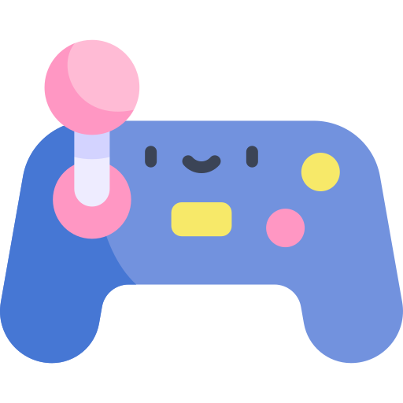

# Joguinhos em Python

Olá! Esse repositório ficará reservado para joguinhos que aprendi em diversos cursos ou que decidi fazer no meu tempo livre!

No momento poucos jogos estarão aqui, mas depois, conforme a minha evolução, atualizarei sempre que possível!

  

Cursos utilizados:
 * Python: começando com a linguagem (Alura)